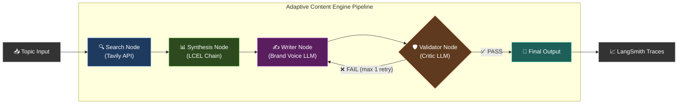

# Project 1: The Adaptive Content Engine

> **Focus**: Mastering LangChain Expression Language (LCEL), Tool Calling, and Dynamic Routing.

A professional marketing pipeline that **researches**, **writes**, and **validates** content — not just a simple writer.

---

## System Architecture



---

## State Management — The Data Contract

Every node reads from and writes to a shared `ContentState`. This `TypedDict` is the **single source of truth**.

```python
from typing import TypedDict, List, Optional

class SearchResult(TypedDict):
    url: str
    title: str
    content: str

class ContentState(TypedDict):
    # --- Input ---
    topic: str                            # User's topic
    brand_voice: str                      # e.g., "professional", "casual", "technical"

    # --- Search Phase ---
    search_results: List[SearchResult]    # Raw Tavily results (5 sources)

    # --- Synthesis Phase ---
    synthesized_context: str              # Structured summary of search results

    # --- Writing Phase ---
    draft_content: str                    # Generated article/content

    # --- Validation Phase ---
    validation_passed: bool               # Did the critic approve?
    validation_feedback: str              # Critic's feedback if failed
    retry_count: int                      # Track retries (max 1)

    # --- Final ---
    final_content: str                    # Approved content
```

### How Data Flows

```
Topic + Brand Voice
       │
       ▼
┌──────────────────┐
│   Search Node    │──► Populates: search_results
└──────────────────┘
       │
       ▼
┌──────────────────┐
│ Synthesis Node   │──► Reads: search_results
│   (LCEL Chain)   │──► Populates: synthesized_context
└──────────────────┘
       │
       ▼
┌──────────────────┐
│  Writer Node     │──► Reads: synthesized_context, brand_voice, validation_feedback
│ (Brand Voice)    │──► Populates: draft_content
└──────────────────┘
       │
       ▼
┌──────────────────┐
│ Validator Node   │──► Reads: draft_content, search_results
│  (Critic LLM)   │──► Populates: validation_passed, validation_feedback
└──────────────────┘
       │
       ├── PASS ──► final_content = draft_content
       └── FAIL ──► retry_count++ → back to Writer (max 1 retry)
```

---

## Key LCEL Concepts

| Concept | Where Used | What It Does |
|---------|-----------|--------------|
| `RunnablePassthrough` | Synthesis & Writer chains | Passes input data through unchanged while adding new computed fields |
| `itemgetter` | Between nodes | Extracts specific keys from the state dict to feed into the next chain |
| `RunnableLambda` | Search Node | Wraps the Tavily API call as a Runnable |
| `prompt \| llm \| parser` | All LLM nodes | The core LCEL pipe pattern |

### Example: The Pipe Pattern

```python
from operator import itemgetter
from langchain_core.runnables import RunnablePassthrough

# This is how LCEL chains work:
synthesis_chain = (
    {
        "search_results": itemgetter("search_results"),  # Extract specific keys
        "topic": itemgetter("topic")
    }
    | synthesis_prompt        # ChatPromptTemplate
    | llm                    # ChatOpenAI
    | StrOutputParser()      # Parse LLM output to string
)
```

---

## Sprint Plan

### Sprint 0 — Project Scaffolding
- Project structure, `requirements.txt`, `.env` setup
- `ContentState` TypedDict definition
- LangSmith tracing configuration

### Sprint 1 — Search Node
- Tavily API integration
- Fetch 5 credible sources for a given topic
- Populate `search_results` in state

### Sprint 2 — Synthesis & Writer Nodes
- LCEL chain for summarizing search results
- Brand voice writer with retry-aware prompting
- `RunnablePassthrough` + `itemgetter` piping

### Sprint 3 — Validator Node + Self-Correction Loop
- Critic LLM with Pydantic `ValidationResult` structured output
- Hallucination check against original search results
- Conditional loop-back (max 1 retry)

### Sprint 4 — Integration & Polish
- Full pipeline assembly
- LangSmith trace verification
- End-to-end testing

---

## Project Structure

```
project1_content_engine/
├── __init__.py
├── state.py              # ContentState TypedDict + Pydantic models
├── nodes/
│   ├── __init__.py
│   ├── search.py         # Tavily search node
│   ├── synthesis.py      # LCEL synthesis chain
│   ├── writer.py         # Brand voice writer
│   └── validator.py      # Hallucination critic
├── pipeline.py           # Full pipeline assembly
└── main.py               # Entry point
```

---

## Industry Standards Used

| Standard | Tool | Purpose |
|----------|------|---------|
| **Tracing** | LangSmith | Full observability of every LLM call, latency, token usage |
| **Output Parsing** | Pydantic v2 | Structured, validated output from the Validator node |
| **Environment Config** | python-dotenv | Secure API key management via `.env` |
| **Search** | Tavily API | Industry-grade web search (not scraping) |

---

## Dependencies

```
langchain>=0.3.0
langchain-openai>=0.3.0
langchain-community>=0.3.0
langsmith>=0.2.0
tavily-python>=0.5.0
pydantic>=2.0
python-dotenv>=1.0.0
```
