# Project 2: The Autonomous DevOps Agent

> **Focus**: LangGraph, State Management, Cycles, Conditional Edges, and Human-in-the-Loop.

A self-correcting code assistant that **plans**, **writes code**, **executes it**, **reads errors**, and **fixes itself** — with human approval before deployment.

---

## Graph Architecture

```mermaid
graph TD
    subgraph "Autonomous DevOps Agent (LangGraph)"
        P["📋 Planner Node"] --> CO["💻 Coder Node"]
        CO --> EX["⚡ Executor Node<br/>(Python REPL)"]
        EX --> DB{"🔧 Debugger<br/>(Conditional Edge)"}
        DB -->|"❌ Error + Logs"| CO
        DB -->|"✅ Success"| HI["🛑 Human Approval<br/>(Breakpoint)"]
        HI -->|"✅ Approved"| FA["📦 Final Answer"]
        HI -->|"❌ Rejected"| CO
    end

    UR["👤 User Requirement"] --> P
    FA --> LS["📈 LangSmith Traces"]

    style P fill:#1e3a5f,stroke:#4a90d9,color:#fff
    style CO fill:#2d4a1e,stroke:#6abf4b,color:#fff
    style EX fill:#5a1e5f,stroke:#b04ad9,color:#fff
    style DB fill:#5f3a1e,stroke:#d9904a,color:#fff
    style HI fill:#5f1e1e,stroke:#d94a4a,color:#fff
    style FA fill:#1e5f5a,stroke:#4ad9b0,color:#fff
    style UR fill:#333,stroke:#888,color:#fff
    style LS fill:#333,stroke:#888,color:#fff
```



---

## State Schema

```python
from typing import TypedDict, List, Optional

class DevOpsState(TypedDict):
    # --- Input ---
    requirement: str              # User's natural language requirement

    # --- Planning Phase ---
    technical_spec: str           # Structured technical specification
    
    # --- Coding Phase ---
    code: str                     # Generated Python script
    
    # --- Execution Phase ---
    execution_output: str         # stdout from Python REPL
    errors: str                   # stderr / traceback if any
    execution_success: bool       # Did the code run without errors?
    
    # --- Debug Loop ---
    iterations: int               # Number of debug cycles (capped)
    max_iterations: int           # Safety limit (e.g., 3)
    error_history: List[str]      # All past errors for context
    
    # --- Human Approval ---
    human_approved: Optional[bool]  # None = pending, True/False = decision
    
    # --- Final ---
    final_code: str               # Approved, working code
    test_results: str             # Summary of test execution
```

---

## Node Definitions

| Node | Input | Output | Description |
|------|-------|--------|-------------|
| **Planner** | `requirement` | `technical_spec` | Breaks user requirement into a step-by-step technical spec |
| **Coder** | `technical_spec`, `errors`, `error_history` | `code` | Writes/fixes Python code based on spec and error feedback |
| **Executor** | `code` | `execution_output`, `errors`, `execution_success` | Runs code in sandboxed Python REPL |
| **Debugger** | `execution_success`, `errors` | *routing decision* | Conditional edge: routes to Coder (error) or Human Approval (success) |
| **Human Approval** | `code`, `execution_output` | `human_approved` | Breakpoint — graph pauses for human review |

---

## Key LangGraph Concepts

| Concept | Usage |
|---------|-------|
| **Conditional Edges** | Debugger routes to Coder or Human Approval based on `execution_success` |
| **Cycles** | Coder → Executor → Debugger → Coder loop for self-correction |
| **Persistent Checkpoints** | `SqliteSaver` for graph state persistence across interrupts |
| **Human-in-the-Loop** | `interrupt_before=["human_approval"]` pauses the graph |
| **State Channels** | `TypedDict` with reducers for `error_history` (append) |

---

*Full implementation will begin after Project 1 is complete.*
